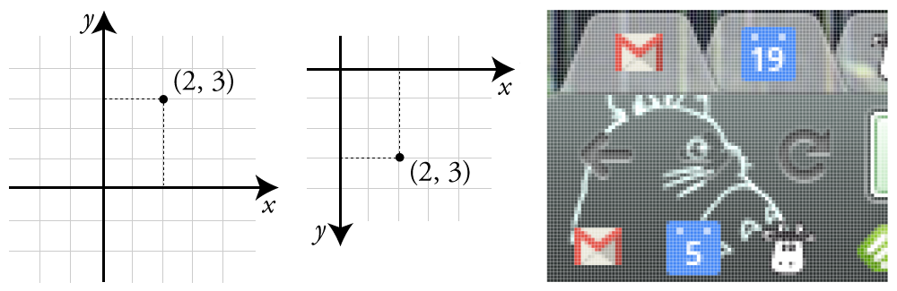
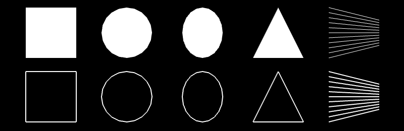
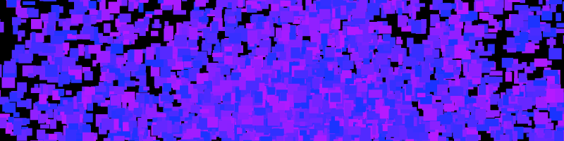
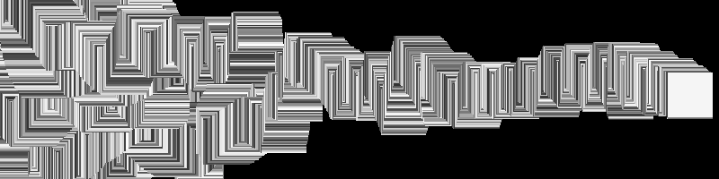
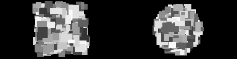
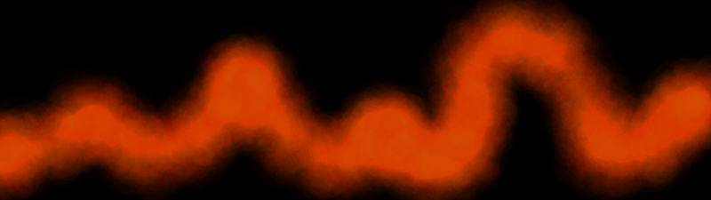
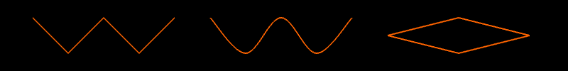
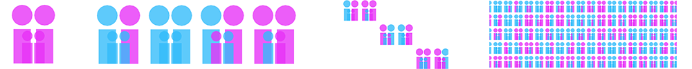
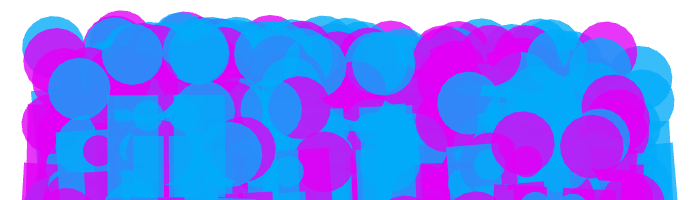

Graphics
========

*By: [Michael Hadley](http://www.mikewesthad.com/) with generous editor support from [Abraham Avnisan](http://abrahamavnisan.com/), [Brannon Dorsey](http://brannondorsey.com/) and [Christopher Baker](http://christopherbaker.net/). Edited by [Rachel Devorah](http://racheldevorah.studio/)*


Brushes with Basic Shapes
-------------------------

To create brushes, we need to define some basic building blocks of graphics. We can classify the 2D graphics functions into two categories: basic shapes and freeform shapes. Basic shapes are rectangles, circles, triangles and straight lines. Freeform shapes are polygons and paths. In this section, we will focus on the basic shapes.

### Basic Shapes

Before drawing any shape, we need to know how to specify locations on screen. Computer graphics use the [Cartesian coordinate system](https://en.wikipedia.org/wiki/Cartesian_coordinate_system). Remember figure 1 (left) from math class? A pair of values `(x, y)` told us how far away we were from `(0, 0)`, the origin. Computer graphics are based on this same system, but with two twists. First, `(0, 0)` is the upper leftmost pixel of the screen. Second, the y axis is flipped such that the positive y direction is located below the origin figure 1 (center).

If we apply this to the top left of my screen figure 1 (right), which happens to be my browser. We can see the pixels and identify their locations in our new coordinate system. The top left pixel is `(0, 0)`. The top left pixel of the blue calendar icon (with the white "19") is `(58, 5)`.



Now that we can talk about locations, let's jump into code. Create an openFrameworks project and call it "BasicShapes" (or something more imaginative). 

Creating an openFrameworks project:
- Go to rootfolder>projectGenerator>projectGenerator
- Click on the wheel
- Check "Advanced Options"
- Go back to the "Create/Update" window
- Correct your filepath if necessary so that it goes to rootfolder/apps/myApps/
- Click on "Template" and select "Visual Studio Code"
- Generate!

Open the source (src) folder, `ofApp.cpp`, and navigate to the `draw()` function. Add the following:

```cpp
ofBackground(0);  // Clear the screen with a black color
ofSetColor(255);  // Set the drawing color to white

// Draw some shapes
ofDrawRectangle(50, 50, 100, 100); // Top left corner at (50, 50), 100 wide x 100 high
ofDrawCircle(250, 100, 50); // Centered at (250, 100), radius of 50
ofDrawEllipse(400, 100, 80, 100); // Centered at (400 100), 80 wide x 100 high
ofDrawTriangle(500, 150, 550, 50, 600, 150); // Three corners: (500, 150), (550, 50), (600, 150)
ofDrawLine(700, 50, 700, 150); // Line from (700, 50) to (700, 150)
```

Save!

## [Building an oF project in VSC](https://openframeworks.cc/setup/vscode/)
- `Terminal`
- `Run Build Task`
- `Build Release`

When we run the code, we see white shapes on a black background. Success! Each time our `draw()` function executes, three things happen. First, we clear the screen by drawing a solid black background using [`ofBackground(...)`](http://openframeworks.cc/documentation/graphics/ofGraphics.html#show_ofBackground). The `0` represents a grayscale color where `0` is completely black and `255` is completely white. Second, we specify what color should be used for drawing with [`ofSetColor(...)`](http://openframeworks.cc/documentation/graphics/ofGraphics.html#show_ofSetColor). We can think of this code as telling openFrameworks to pull out a specific colored marker. When we draw, we will draw in that color until we specify that we want another color. Third, we draw our basic shapes with [`ofDrawRectangle(...)`](http://openframeworks.cc/documentation/graphics/ofGraphics.html#!show_ofDrawRectangle), [`ofDrawCircle(...)`](http://openframeworks.cc/documentation/graphics/ofGraphics.html#!show_ofDrawCircle), [`ofDrawEllipse(...)`](http://openframeworks.cc/documentation/graphics/ofGraphics.html#!show_ofDrawEllipse), [`ofDrawTriangle(...)`](http://openframeworks.cc/documentation/graphics/ofGraphics.html#!show_ofDrawTriangle) and [`ofDrawLine(...)`](http://openframeworks.cc/documentation/graphics/ofGraphics.html#!show_ofDrawLine). Check out the comments in the example to better understand how we are using the drawing functions. The functions can be used in other ways as well, so check out the openFrameworks documentation if you are curious.

[`ofFill()`](http://openframeworks.cc/documentation/graphics/ofGraphics.html#!show_ofFill) and [`ofNoFill()`](http://openframeworks.cc/documentation/graphics/ofGraphics.html#!show_ofFill) toggle between drawing filled shapes and drawing outlines. The colored marker analogy doesn't fit, but the concept still applies. `ofFill()` tells openFrameworks to draw filled shapes until told otherwise. `ofNoFill()` does the same but with outlines. So we can draw two rows of shapes on our screen (figure 2) - one filled and one outlines - if we modify our `draw()` function to look like:

```cpp
ofFill(); // If we omit this and leave ofNoFill(), all the shapes will be outlines!
// Draw some shapes (code omitted)

ofNoFill(); // If we omit this and leave ofFill(), all the shapes will be filled!
// Draw some shapes (code omitted)
```

The circle and ellipse are looking a bit jagged, so we can fix that with [`ofSetCircleResolution(...)`](http://openframeworks.cc/documentation/gl/ofGLProgrammableRenderer.html#!show_setCircleResolution). Circles and ellipses are drawn by connecting a series of points with straight lines. If we take a close look at the circle in figure 2, and we'll be able to identify the 20 tiny straight lines. That's the default resolution. Try putting `ofSetCircleResolution(50)` in the `setup()` function.

The individual lines that make up our outlines can be jagged too. We can fix that with a smoothing technique called [anti-aliasing](https://en.wikipedia.org/wiki/Spatial_anti-aliasing). We probably don't need to worry about this since anti-aliasing will be turned on by default in recent versions of openFrameworks. If it isn't, just add [`ofEnableAntiAliasing()`](http://openframeworks.cc/documentation/graphics/ofGraphics.html#show_ofEnableAntiAliasing) to `setup()`. (For future reference, you can turn it off to save computing power: [`ofDisableAntiAliasing()`](http://openframeworks.cc/documentation/graphics/ofGraphics.html#show_ofDisableAntiAliasing).)



\[[Source code for this section](https://github.com/openframeworks/ofBook/tree/master/chapters/intro_to_graphics/code/1_i_Basic_Shapes)\]

### Brushes from Basic Shapes

We survived the boring bits, but why draw one rectangle, when we can draw a million (figure 3)? That is essentially what we will be doing in this section. We will build brushes that drop a burst of many small shapes whenever we press the left mouse button. To make things more exciting, we will mix in some randomness. Start a new openFrameworks project, called "ShapeBrush."



#### Single Rectangle Brush: Using the Mouse

We are going to lay down the foundation for our brushes by making a simple one that draws a single rectangle when we hold down the mouse. To get started, we are going to need to know 1) the mouse location and 2) if the left mouse button is pressed.

For 1), we can use two openFrameworks functions that return `int` variables: [`ofGetMouseX()`](http://openframeworks.cc/documentation/events/ofEvents.html#show_ofGetMouseX) and [`ofGetMouseY()`](http://openframeworks.cc/documentation/events/ofEvents.html#show_ofGetMouseY). We will use them in `draw()`.

For 2), we can find out whether the left mouse button is pressed using [`ofGetMousePressed(...)`](http://openframeworks.cc/documentation/events/ofEvents.html#show_ofGetMousePressedd). The function asks us to pass in an `int` that represents which mouse button is we want to know about. openFrameworks provides some "public constants" for use here: `OF_MOUSE_BUTTON_LEFT`, `OF_MOUSE_BUTTON_MIDDLE` and `OF_MOUSE_BUTTON_RIGHT`. These public constants are just `int` variables that cannot be changed and can be accessed anywhere you have included openFrameworks. So `ofGetMousePressed(OF_MOUSE_BUTTON_LEFT)` will return `true` if the left button is pressed and will return `false` otherwise.

Let's add some graphics. Hop over to the `draw()` function where we can bring these new functions together:

```cpp
if (ofGetMousePressed(OF_MOUSE_BUTTON_LEFT)) {  // If the left mouse button is pressed...
    ofSetColor(255);
    ofSetRectMode(OF_RECTMODE_CENTER);
    ofDrawRectangle(ofGetMouseX(), ofGetMouseY(), 50, 50);  // Draw a 50 x 50 rect centered over the mouse
}
```

[`ofSetRectMode(...)`](http://openframeworks.cc/documentation/graphics/ofGraphics.html#show_ofSetRectMode) allows us to control how the `(x, y)` we pass into `ofDrawRectangle(...)` are used to draw. By default, they are interpreted as the upper left corner (`OF_RECTMODE_CORNER`). For our purposes, we want them to be the center (`OF_RECTMODE_CENTER`), so our rectangle is centered over the mouse.

Compile and run. A white rectangle is drawn at the mouse position when we press the left mouse button ... but it disappears immediately. By default, the screen is cleared with every `draw()` call. We can change that with [`ofSetBackgroundAuto(...)`](http://openframeworks.cc/documentation/graphics/ofGraphics.html#show_ofSetBackgroundAuto). Passing in a value of `false` turns off the automatic background clearing. Add the following lines into `setup()`:

```cpp
ofSetBackgroundAuto(false);

// We still want to draw on a black background, so we need to draw
// the background before we do anything with the brush
ofBackground(0);
```

First brush, done! We are going to make this a bit more interesting by adding 1) randomness and 2) repetition.

Randomness can make our code dark, mysterious and unpredictable. Meet [`ofRandom(...)`](http://openframeworks.cc/documentation/math/ofMath.html#!show_ofRandom). It can be used in two different ways: by passing in two values `ofRandom(float min, float max)` or by passing in a single value `ofRandom(float max)` where the min is assumed to be `0`. The function returns a random value between the min and max. We can inject some randomness into our rectangle color (figure 4) by using in `draw()`:

```cpp
float randomColor = ofRandom(50, 255);
ofSetColor(randomColor);  // Exclude dark grayscale values (0 - 50) that won't show on black background
```



To finish off this single rectangle brush, let's add the ability to erase by pressing the right mouse button by adding this to our `draw()` function:

```cpp
if (ofGetMousePressed(OF_MOUSE_BUTTON_RIGHT)) {  // If the right mouse button is pressed...
    ofBackground(0);  // Draw a black background over the screen
}
```

\[[Source code for this section](https://github.com/openframeworks/ofBook/tree/master/chapters/intro_to_graphics/code/1_ii_a_Single_Rectangle_Brush)\]


#### Bursting Rectangle Brush: Creating Randomized Bursts

We now have the basics in place for a brush, but instead of drawing a single rectangle in `draw()`, let's draw a burst of randomized rectangles. We are going use a `for` loop to create multiple rectangles whose parameters are randomly chosen. What can we randomize? Grayscale color, width and height are easy candidates. We can also use a small positive or negative value to offset each rectangle from mouse position. Modify `draw()` to look like this:

```cpp
if (ofGetMousePressed(OF_MOUSE_BUTTON_LEFT)) {  // If the left mouse button is pressed...
    ofSetRectMode(OF_RECTMODE_CENTER);
    int numRects = 10;
    for (int r=0; r<numRects; r++) {
        ofSetColor(ofRandom(50, 255));
        float width = ofRandom(5, 20);
        float height = ofRandom(5, 20);
        float xOffset = ofRandom(-40, 40);
        float yOffset = ofRandom(-40, 40);
        ofDrawRectangle(ofGetMouseX()+xOffset, ofGetMouseY()+yOffset, width, height);
    }
}
```

But! Add one more thing, inside of `setup()`, before hitting run: `ofSetFrameRate(60)`. The frame rate is the speed limit of our program, frames per second (fps). `update()` and `draw()` will not run more than `60` times per second. (ofSketch users - we'll talk about `update()` later.) Note: this is a speed *limit*, not a speed *minimum* - our code can run slower than `60` fps. We set the frame rate in order to control how many rectangles will be drawn. If `10` rectangles are drawn with the mouse pressed and we know `draw()` won't be called more than `60` times per second, then we will generate a max of `600` rectangles per second.

Compile, run. We get a box-shaped spread of random rectangles (figure 5, left). Why didn't we get a circular spread (figure 5, right)? Since `xOffset` and `yOffset` could be any value between `-40` and `40`, think about what happens when `xOffset` and `yOffset` take on their most extreme values, i.e. (xOffset, yOffset) values of (-40, -40), (40, -40), (40, 40) and (-40, 40).

If we want a random point within a circle, it helps to think in terms of angles. Imagine we are at the center of a circle. If we rotate a random amount (the *polar angle*) and then move a random distance (the *polar radius*), we end up in a random location within the circle (assuming we don't walk so far that we cross the boundary of our circle). We just defined a point by a polar angle and a polar radius instead of using `(x, y)`. We have just thought about space in terms of [Polar coordinates](https://en.wikipedia.org/wiki/Polar_coordinate_system), instead of [Cartesian coordinates](https://en.wikipedia.org/wiki/Cartesian_coordinate_system).

Back to the code. When we figure out our offsets, we want to pick a random direction (polar angle) and random distance (polar distance) which we can then convert to Cartesian coordinates (see code) to use as `xOffset` and `yOffset`. Our loop inside of `draw()` will look like this:

```cpp
for (int r=0; r<numRects; r++) {
    ofSetColor(ofRandom(50, 255));
    float width = ofRandom(5, 20);
    float height = ofRandom(5, 20);
    float distance = ofRandom(35);

    // Formula for converting from polar to Cartesian coordinates:
    //  x = cos(polar angle) * (polar distance)
    //  y = sin(polar angle) * (polar distance)

    // We need our angle to be in radians if we want to use sin() or cos()
    // so we can make use of an openFrameworks function to convert from degrees
    // to radians
    float angle = ofRandom(ofDegToRad(360.0));

    float xOffset = cos(angle) * distance;
    float yOffset = sin(angle) * distance;
    ofDrawRectangle(ofGetMouseX()+xOffset, ofGetMouseY()+yOffset, width, height);
}
```



\[[Source code for this section](https://github.com/openframeworks/ofBook/tree/master/chapters/intro_to_graphics/code/1_ii_b_Bursting_Rect_Brush)\]


#### Glowing Circle Brush: Using Transparency and Color

Unlike what we did with the rectangle brush, we are going to layer colorful, transparent circles on top of each to create a glowing haze. We will draw a giant transparent circle, then draw a slightly smaller transparent circle on top of it, then repeat, repeat, repeat. We can add transparency to `ofSetColor(...)` with a second parameter, the alpha channel (e.g.`ofSetColor(255, 50)`), with a value from `0` (completely transparent) to `255` (completely opaque).

Before we use alpha, we need to enable something called "alpha blending." Using transparency costs computing power, so [`ofEnableAlphaBlending()`](http://openframeworks.cc/documentation/graphics/ofGraphics.html#show_ofEnableAlphaBlending) and [`ofDisableAlphaBlending()`](http://openframeworks.cc/documentation/graphics/ofGraphics.html#show_ofDisableAlphaBlending) allow us to turn on and off this blending at our discretion. We need it, so enable it in `setup()`.

Comment out the rectangle brush code inside the `if` statement that checks if the left mouse button is pressed. Now we can start working on our circle brush. We will use the `angle`, `distance`, `xOffset` and `yOffset` code like before. Our `for` loop will start with a large radius and step its value to `0`. Add the following:

```cpp
int maxRadius = 100;  // Increase for a wider brush
int radiusStepSize = 5;  // Decrease for more circles (i.e. a more opaque brush)
int alpha = 3;  // Increase for a more opaque brush
int maxOffsetDistance = 100;  // Increase for a larger spread of circles
// draw smaller and smaller circles and layering (increasing) opaqueness
for (int radius=maxRadius; radius>0; radius-=radiusStepSize) {
    float angle = ofRandom(ofDegToRad(360.0));
    float distance = ofRandom(maxOffsetDistance);
    float xOffset = cos(angle) * distance;
    float yOffset = sin(angle) * distance;
    ofSetColor(255, alpha);
    ofDrawCircle(ofGetMouseX()+xOffset, ofGetMouseY()+yOffset, radius);
}
```



We end up with something like figure 6, a glowing light except without color. Tired of living in moody shades of gray? `ofSetColor(...)` can make use of the [Red Blue Green (RGB) color model](https://en.wikipedia.org/wiki/RGB_color_model) in addition to the grayscale color model. We specify the amount (`0` to `255`) of red, blue and green light respectively, e.g. `ofSetColor(255, 0, 0)` for opaque red. We can also add alpha, e.g. `ofSetColor(0, 0, 255, 10)` for transparent blue. Go ahead and modify the `ofSetColor(...)` in our circle brush to use a nice orange: `ofSetColor(255, 103, 0, alpha)`.

There's another way we can use `ofSetColor(...)`. Meet [`ofColor`](http://openframeworks.cc/documentation/types/ofColor.html), a handy class for handling colors which allows for fancy color math (among other things). Here are some examples of defining and modifying colors:

```cpp
ofColor myOrange(255, 132, 0); // Defining an opaque orange color - specified using RGB
ofColor myBlue(0, 0, 255, 50); // Defining a transparent blue color - specified using RGBA

// We can access the red, green, blue and alpha channels like this:
ofColor myGreen(0, 0, 255, 255);
cout << "Red channel:" << myGreen.r << endl;
cout << "Green channel:" << myGreen.g << endl;
cout << "Blue channel:" << myGreen.b << endl;
cout << "Alpha channel:" << myGreen.a << endl;

// We can also set the red, green, blue and alpha channels like this:
ofColor myYellow;
myYellow.r = 255;
myYellow.b = 0;
myYellow.g = 255;
myYellow.a = 255;

// We can also make use of some predefined colors provided by openFrameworks:
ofColor myAqua = ofColor::aqua;
ofColor myPurple = ofColor::plum;
// Full list of colors available at: http://openframeworks.cc/documentation/types/ofColor.html
```

If we wanted to make our brush fierier, we would draw using random colors that are in-between orange and red. `ofColor` gives us in-betweenness using something called "[linear interpolation](https://en.wikipedia.org/wiki/Linear_interpolation)" with a function called [`getLerped(...)`](http://openframeworks.cc/documentation/types/ofColor.html#show_getLerped). `getLerped(...)` is a class method of `ofColor`, which means that if we have an `ofColor` variable, we can interpolate like this: `myFirstColor.getLerped(mySecondColor, 0.3)`. (For an explanation of classes and methods, see the *OOPS!* chapter.) We pass in two arguments, an `ofColor` and a `float` value between `0.0` and `1.0`. The function returns a new `ofColor` that is between the two specified colors, and the `float` determines how close the new color is to our original color (here, `myFirstColor`). We can use this in `draw()` like this:

```cpp
ofColor myOrange(255, 132, 0, alpha);
ofColor myRed(255, 6, 0, alpha);
ofColor inBetween = myOrange.getLerped(myRed, ofRandom(1.0));
ofSetColor(inBetween);
```

\[[Source code for this section](https://github.com/openframeworks/ofBook/tree/master/chapters/intro_to_graphics/code/1_ii_c_Glowing_Circle_Brush)\]

#### Raster Graphics: Taking a Snapshot

Before we move on, let's save a snapshot of our canvas. We'll want to use the [`keyPressed(int key)`](http://openframeworks.cc/documentation/application/ofBaseApp.html#!show_keyPressed) function. This function is built into your application by default. Any time a key is pressed, the code you put into this function is called. The `key` variable is an integer that represents the key that was pressed.

If you are using project generator, you'll find `keyPressed(...)` in your `.cpp` file. If you are using ofSketch, you might not see the function, but it is easy to add. See the [ofSketch file](https://github.com/openframeworks/ofBook/blob/master/chapters/intro_to_graphics/code/1_ii_e_Triangle_Brush.sketch) for the last section.

In the `keyPressed(...)` function, add the following:

```cpp
if (key == 's') {
    // It's strange that we can compare the int key to a character like `s`, right?  Well, the super short
    // explanation is that characters are represented by numbers in programming.  `s` and 115 are the same
    // thing.  If you want to know more, check out the wiki for ASCII.
    glReadBuffer(GL_FRONT);  // HACK: only needed on windows, when using ofSetAutoBackground(false)
    ofSaveScreen("savedScreenshot_"+ofGetTimestampString()+".png");
}
```

[`ofSaveScreen(...)`](http://openframeworks.cc/documentation/utils/ofUtils.html#show_ofSaveScreen) grabs the current screen and saves it to a file inside of our project's `./bin/data/` folder with a filename we specify. The timestamp is used to create a unique filename, allowing us to save multiple screenshots without worrying about them overriding each other. So press the `s` key and check out your screenshot!

Brushes from Freeform Shapes
----------------------------

In the last section, we drew directly onto the screen. We were storing graphics (brush strokes) as pixels, and therefore working with [raster graphics](https://en.wikipedia.org/wiki/Raster_graphics). For this reason, it is hard to isolate, move or erase a single brush stroke. It also means we can't re-render our graphics at a different resolution. In contrast, [vector graphics](https://en.wikipedia.org/wiki/Vector_graphics) store graphics as a list of geometric objects instead of pixel values. Those objects can be modified (erased, moved, rescaled, etc.) after we "place" them on our screen.

In this section, we are going to make a kind of vector graphics by using custom ("freeform") shapes in openFrameworks. We will use structures (`ofPolyline` and `vector<ofPolyline>`) that allow us to store and draw the path that the mouse takes on the screen. Then we will play with those paths to create brushes that do more than just trace out the cursor's movement.

### Basic Polylines

Create a new project called "Polylines," and say hello to [`ofPolyline`](http://openframeworks.cc/documentation/graphics/ofPolyline.html). `ofPolyline` is a data structure that allows us to store a series of sequential points and then connect them to draw a line. Let's dive into some code. In your header file (inside "class ofApp" in "ofApp.h" to be precise), define three `ofPolylines`:

```cpp
ofPolyline straightSegmentPolyline;
ofPolyline curvedSegmentPolyline;
ofPolyline closedShapePolyline;
```

We can fill those `ofPolylines` with points in `setup()`:

```cpp
straightSegmentPolyline.addVertex(100, 100);  // Add a new point: (100, 100)
straightSegmentPolyline.addVertex(150, 150);  // Add a new point: (150, 150)
straightSegmentPolyline.addVertex(200, 100);  // etc...
straightSegmentPolyline.addVertex(250, 150);
straightSegmentPolyline.addVertex(300, 100);

curvedSegmentPolyline.curveTo(350, 100);  // These curves are Catmull-Rom splines
curvedSegmentPolyline.curveTo(350, 100);  // Necessary Duplicate for Control Point
curvedSegmentPolyline.curveTo(400, 150);
curvedSegmentPolyline.curveTo(450, 100);
curvedSegmentPolyline.curveTo(500, 150);
curvedSegmentPolyline.curveTo(550, 100);
curvedSegmentPolyline.curveTo(550, 100);  // Necessary Duplicate for Control Point

closedShapePolyline.addVertex(600, 125);
closedShapePolyline.addVertex(700, 100);
closedShapePolyline.addVertex(800, 125);
closedShapePolyline.addVertex(700, 150);
closedShapePolyline.close();  // Connect first and last vertices
```

We can now draw our polylines in the `draw()` function:

```cpp
ofBackground(0);
ofSetLineWidth(2.0);  // Line widths apply to polylines
ofSetColor(255,100,0);
straightSegmentPolyline.draw();  // This is how we draw polylines
curvedSegmentPolyline.draw();  // Nice and easy, right?
closedShapePolyline.draw();
```

We created three different types of polylines (figure 11). `straightSegmentPolyline` is composed of a series points connected with straight lines. `curvedSegmentPolyline` uses the same points but connects them with curved lines. The curves that are created are [Catmull–Rom splines](https://en.wikipedia.org/wiki/Centripetal_Catmull%E2%80%93Rom_spline), which use four points to define a curve: two define the start and end, while two control points determine the curvature. These control points are the reason why we need to add the first and last vertex twice. Lastly, `closedShapePolyline` uses straight line segments that are closed, connecting the first and last vertices.



The advantage of drawing in this way (versus raster graphics) is that the polylines are modifiable. We could easily move, add, delete, scale our vertices on the the fly.

\[[Source code for this section](https://github.com/openframeworks/ofBook/tree/master/chapters/intro_to_graphics/code/2_i_Basic_Polylines)\]


Moving The World
----------------

We've been making brushes for a long time, so let's move onto something different: moving the world. By the world, I really just mean the coordinate system (though it sounds more exciting the other way).

Whenever we call a drawing function, like `ofDrawRectangle(...)` for example, we pass in an `x` and `y` location at which we want our shape to be drawn. We know (0,0) to be the upper left pixel of our window, that the positive x direction is rightward across our window and that positive y direction is downward along our window (recall figure 1). We are about to violate this established knowledge.

Imagine that we have a piece of graphing paper in front of us. How would we draw a black rectangle at (5, 10) that is 5 units wide and 2 units high? We would probably grab a black pen, move our hands to (5, 10) on our graphing paper, and start filling in boxes? Pretty normal, but we could have also have kept our pen hand stationary, moved our paper 5 units left and 10 units down and then started filling in boxes. Seems odd, right? This is actually a powerful concept. With openFrameworks, we can move our coordinate system like this using `ofTranslate(...)`, but we can *also* rotate and scale with `ofRotate(...)` and `ofScale(...)`. We will start with translating to cover our screen with stick figures, and then we will rotate and scale to create spiraling rectangles.

### Translating: Stick Family

[`ofTranslate`](http://openframeworks.cc/documentation/graphics/ofGraphics.html#show_ofTranslate) first. `ofTranslate(...)` takes an x, a y and an optional z parameter, and then shifts the coordinate system by those specified values. Why do this? Create a new project and add this to our `draw()` function of our source file (.cpp):

```cpp
// Draw the stick figure family
ofDrawCircle(30, 30, 30);
ofDrawRectangle(5, 70, 50, 100);
ofDrawCircle(95, 30, 30);
ofDrawRectangle(70, 70, 50, 100);
ofDrawCircle(45, 90, 15);
ofDrawRectangle(30, 110, 30, 60);
ofDrawCircle(80, 90, 15);
ofDrawRectangle(65, 110, 30, 60);
```

Draw a white background and color the shapes. You should end up with something like the leftmost portion of Figure 18.



What if, after figuring out where to put our shapes, we needed to draw them at a different spot on the screen, or to draw a row of copies? We *could* change all the positions manually, or we could use `ofTranslate(...)` to move our coordinate system and leave the positions alone:

```cpp
// Loop and draw a row
for (int cols=0; cols<4; cols++) {

    // Draw the stick figure family (code omitted)

    ofTranslate(150, 0);
}
```

So our original shapes are wrapped it in a loop with `ofTranslate(150, 0)`, which shifts our coordinate system to the left 150 pixels each time it executes. And we'll end up with figure 18 (second from left). Or something close to that, I randomized the colors in the figure - every family is different, right?

If we wanted to create a grid of families, we will run into problems. After the first row of families, our coordinate system will have been moved quite far to the left. If we move our coordinate system up in order to start drawing our second row, we will end up drawing off the screen in a diagonal. It would look like figure 18 (third from left).

So what we need is to reset the coordinate system using [`ofPushMatrix()`](http://openframeworks.cc/documentation/graphics/ofGraphics.html#show_ofPushMatrix) and [`ofPopMatrix()`](http://openframeworks.cc/documentation/graphics/ofGraphics.html#show_ofPopMatrix). `ofPushMatrix()` saves the current coordinate system and `ofPopMatrix()` returns us to the last saved coordinate system. These functions have the word matrix in them because openFrameworks stores all of our combined rotations, translations and scalings in a single matrix. So we can use these new functions like this:

```cpp
    for (int rows=0; rows<10; rows++) {
        ofPushMatrix(); // Save the coordinate system before we shift it horizontally

        // It is often helpful to indent any code in-between push and pop matrix for readability

        // Loop and draw a row (code omitted)

        ofPopMatrix(); // Return to the coordinate system before we shifted it horizontally
        ofTranslate(0, 200);
    }
```

And we should end up with a grid. See figure 18, right. (I used `ofScale` to jam many in one image.) Or if you hate grids, we can make a mess of a crowd using random rotations and translations, figure 19.



\[[Source code for this section](https://github.com/openframeworks/ofBook/tree/master/chapters/intro_to_graphics/code/3_i_Translating_Stick_Family)\]